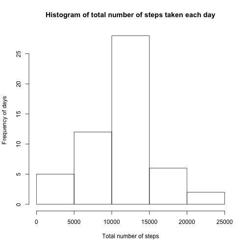
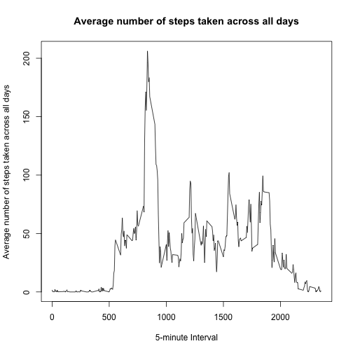
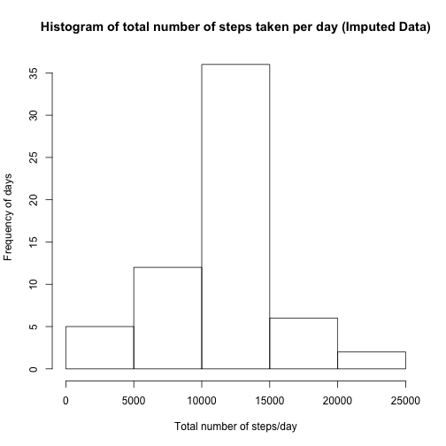
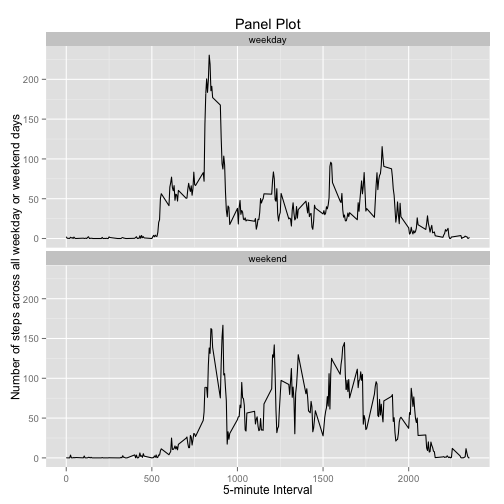

Reproducible Research Peer Assessment 1
========================================================

This is an R Markdown document. Markdown is a simple formatting syntax for authoring web pages (click the **Help** toolbar button for more details on using R Markdown).


```r
##Set wd
setwd("~/RepData_PeerAssessment1")

# load the csv in data frame with the data as is in the file
df <- read.csv("activity.csv", as.is=TRUE)
```

## What is mean total number of steps taken per day?
For this part of the assignment, you can ignore the missing values in the dataset.

### Calculate the total number of steps taken per day


```r
# Generate data frame that omits missing values
df_nomiss <- df[ with (df, { !(is.na(steps)) } ), ]

## Calculate the total number of steps taken per day
steps_per_day <- aggregate(steps ~ date, df_nomiss, sum)
steps_per_day
```

```
##          date steps
## 1  2012-10-02   126
## 2  2012-10-03 11352
## 3  2012-10-04 12116
## 4  2012-10-05 13294
## 5  2012-10-06 15420
## 6  2012-10-07 11015
## 7  2012-10-09 12811
## 8  2012-10-10  9900
## 9  2012-10-11 10304
## 10 2012-10-12 17382
## 11 2012-10-13 12426
## 12 2012-10-14 15098
## 13 2012-10-15 10139
## 14 2012-10-16 15084
## 15 2012-10-17 13452
## 16 2012-10-18 10056
## 17 2012-10-19 11829
## 18 2012-10-20 10395
## 19 2012-10-21  8821
## 20 2012-10-22 13460
## 21 2012-10-23  8918
## 22 2012-10-24  8355
## 23 2012-10-25  2492
## 24 2012-10-26  6778
## 25 2012-10-27 10119
## 26 2012-10-28 11458
## 27 2012-10-29  5018
## 28 2012-10-30  9819
## 29 2012-10-31 15414
## 30 2012-11-02 10600
## 31 2012-11-03 10571
## 32 2012-11-05 10439
## 33 2012-11-06  8334
## 34 2012-11-07 12883
## 35 2012-11-08  3219
## 36 2012-11-11 12608
## 37 2012-11-12 10765
## 38 2012-11-13  7336
## 39 2012-11-15    41
## 40 2012-11-16  5441
## 41 2012-11-17 14339
## 42 2012-11-18 15110
## 43 2012-11-19  8841
## 44 2012-11-20  4472
## 45 2012-11-21 12787
## 46 2012-11-22 20427
## 47 2012-11-23 21194
## 48 2012-11-24 14478
## 49 2012-11-25 11834
## 50 2012-11-26 11162
## 51 2012-11-27 13646
## 52 2012-11-28 10183
## 53 2012-11-29  7047
```
### Calculate and report the mean and median total number of steps taken per day.

```r
mean(steps_per_day$steps)
```

```
## [1] 10766.19
```

```r
median(steps_per_day$steps)
```

```
## [1] 10765
```
### *The total mean steps per day is 10766 and the median is 10765.*

## Make a histogram of the total number of steps taken each day.

```r
hist(steps_per_day$steps, main="Histogram of total number of steps taken each day", 
     xlab="Total number of steps", ylab="Frequency of days")
```

 
## What is the average daily activity pattern?

### Make a time series plot (i.e. type = "l") of the 5-minute interval (x-axis) and the average number of steps taken, averaged across all days (y-axis)

```r
# Getting data ready for time series plot
steps_per_int <- aggregate(steps ~ interval, df_nomiss, mean)

# create a time series plot 
plot(steps_per_int$interval, steps_per_int$steps, type='l', 
     main="Average number of steps taken across all days", xlab="5-minute Interval", 
     ylab="Average number of steps taken across all days")
```

 
### Which 5-minute interval, on average across all the days in the dataset, contains the maximum number of steps?

```r
# find the maximum number of steps
max_steps_row <- which.max(steps_per_int$steps)

# find the 5-minute interval with this maximum row in it
steps_per_int[max_steps_row, ]
```

```
##     interval    steps
## 104      835 206.1698
```
### *The interval number 835 contains the row with the maximum number of steps, which is 206.1698*

## Imputing missing values
Note that there are a number of days/intervals where there are missing values (coded as NA). The presence of missing days may introduce bias into some calculations or summaries of the data.

### Calculate and report the total number of missing values in the dataset (i.e. the total number of rows with NAs)

```r
# Create df with the NA records only
df_NAnumber<- df[!complete.cases(df),]

# Count the number of NA rows
nrow(df_NAnumber)
```

```
## [1] 2304
```
### *The number of rows with NA records is 2304*

### Devise a strategy for filling in all of the missing values in the dataset. The strategy does not need to be sophisticated. For example, you could use the mean/median for that day, or the mean for that 5-minute interval, etc.
### Create a new dataset that is equal to the original dataset but with the missing data filled in.

```r
# Strategy to fill in all the missing data - imputation
for (i in 1:nrow(df)){
  if (is.na(df$steps[i])){
    int_val <- df$interval[i]
    row_id <- which(steps_per_int$interval == int_val)
    steps_val <- steps_per_int$steps[row_id]
    df$steps[i] <- steps_val
  }
}

# aggregate steps as per date to get total number of steps in a day
steps_imputed <- aggregate(steps ~ date, df, sum)
```

### Make a histogram of the total number of steps taken each day 

```r
# create histogram of total number of steps in a day
hist(steps_imputed$steps, main="Histogram of total number of steps taken per day (Imputed Data)", xlab="Total number of steps/day", ylab="Frequency of days")
```

 
### Calculate and report the mean and median total number of steps taken per day. 

```r
mean(steps_imputed$steps)
```

```
## [1] 10766.19
```

```r
median(steps_imputed$steps)
```

```
## [1] 10766.19
```
### *The total mean steps per day is 10766 and the median is 10766.*

### Do these values differ from the estimates from the first part of the assignment? 
*Yes, they do differ slightly due to the imputation.*

### What is the impact of imputing missing data on the estimates of the total daily number of steps?

```r
steps_imputed
```

```
##          date    steps
## 1  2012-10-01 10766.19
## 2  2012-10-02   126.00
## 3  2012-10-03 11352.00
## 4  2012-10-04 12116.00
## 5  2012-10-05 13294.00
## 6  2012-10-06 15420.00
## 7  2012-10-07 11015.00
## 8  2012-10-08 10766.19
## 9  2012-10-09 12811.00
## 10 2012-10-10  9900.00
## 11 2012-10-11 10304.00
## 12 2012-10-12 17382.00
## 13 2012-10-13 12426.00
## 14 2012-10-14 15098.00
## 15 2012-10-15 10139.00
## 16 2012-10-16 15084.00
## 17 2012-10-17 13452.00
## 18 2012-10-18 10056.00
## 19 2012-10-19 11829.00
## 20 2012-10-20 10395.00
## 21 2012-10-21  8821.00
## 22 2012-10-22 13460.00
## 23 2012-10-23  8918.00
## 24 2012-10-24  8355.00
## 25 2012-10-25  2492.00
## 26 2012-10-26  6778.00
## 27 2012-10-27 10119.00
## 28 2012-10-28 11458.00
## 29 2012-10-29  5018.00
## 30 2012-10-30  9819.00
## 31 2012-10-31 15414.00
## 32 2012-11-01 10766.19
## 33 2012-11-02 10600.00
## 34 2012-11-03 10571.00
## 35 2012-11-04 10766.19
## 36 2012-11-05 10439.00
## 37 2012-11-06  8334.00
## 38 2012-11-07 12883.00
## 39 2012-11-08  3219.00
## 40 2012-11-09 10766.19
## 41 2012-11-10 10766.19
## 42 2012-11-11 12608.00
## 43 2012-11-12 10765.00
## 44 2012-11-13  7336.00
## 45 2012-11-14 10766.19
## 46 2012-11-15    41.00
## 47 2012-11-16  5441.00
## 48 2012-11-17 14339.00
## 49 2012-11-18 15110.00
## 50 2012-11-19  8841.00
## 51 2012-11-20  4472.00
## 52 2012-11-21 12787.00
## 53 2012-11-22 20427.00
## 54 2012-11-23 21194.00
## 55 2012-11-24 14478.00
## 56 2012-11-25 11834.00
## 57 2012-11-26 11162.00
## 58 2012-11-27 13646.00
## 59 2012-11-28 10183.00
## 60 2012-11-29  7047.00
## 61 2012-11-30 10766.19
```
*The mean has remained the same, but the imputation has increased the median, so the total number of daily steps seems to have increased slightly.  It added in the days that were missing as well, causing the median to increase slightly above when the NAs are removed.*

## Are there differences in activity patterns between weekdays and weekends?
For this part the weekdays() function may be of some help here. Use the dataset with the filled-in missing values for this part.

## Create a new factor variable in the dataset with two levels – “weekday” and “weekend” indicating whether a given date is a weekday or weekend day.

```r
# convert date from character to Date class, using original data containing all data, including missing values (df)
df$date <- as.Date(df$date, "%Y-%m-%d")

# add a new column indicating day of the week using the weekdays function 
df$day <- weekdays(df$date)

# add a new character variable called type_day and set it first to weekday
df$type_day <- c("weekday")

# If the day is a weekend (Sat or Sun), make type_day as weekend
for (i in 1:nrow(df)){
  if (df$day[i] == "Saturday" || df$day[i] == "Sunday"){
    df$type_day[i] <- "weekend"
  }
}

# convert type_day from character to factor variable originally requested
df$type_day <- as.factor(df$type_day)
```
## Make a panel plot containing a time series plot (i.e. type = "l") of the 5-minute interval (x-axis) and the average number of steps taken, averaged across all weekday days or weekend days (y-axis). 
See the README file in the GitHub repository to see an example of what this plot should look like using simulated data.

```r
# get average number of steps in an interval across all days
df_avg <- aggregate(steps ~ interval+type_day, df, mean)

# make the panel plot for weekdays and weekends by first loading the library
library(ggplot2)
```

```
## Warning: package 'ggplot2' was built under R version 3.1.3
```

```r
# Create panel plot
qplot(interval, steps, data = df_avg, type = 'l', geom=c("line"), xlab = "5-minute Interval", ylab = "Number of steps across all weekday or weekend days", main = "Panel Plot") + facet_wrap(~ type_day, ncol = 1)
```

 
